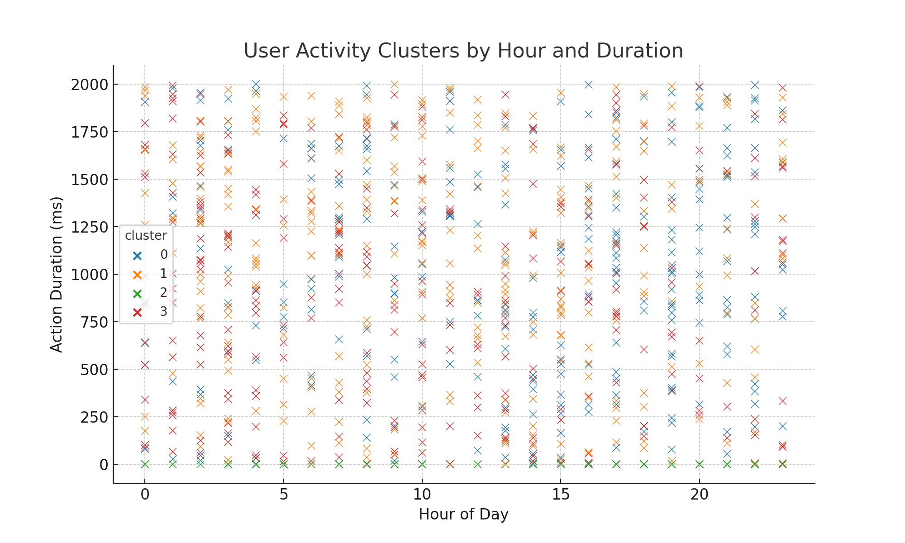

# BlackBox-Ghost
Untraceable behavior anomaly detection model for secure internal systems.
## Overview  
BlackBox:Ghost is a synthetic environment used to test internal security protocols through behavior anomaly detection. The system was built to simulate compromised user activity and catch high-risk data movements in real-time.

## Features  
- Isolation Forest and KMeans for anomaly classification  
- Synthetic datasets mimicking real-world access logs  
- Real-time dashboard visualizations using Plotly  
- Modular codebase for adapting to different threat models  

## Tools Used  
- Python  
- Pandas  
- Scikit-learn  
- TensorFlow  
- PostgreSQL  
- Jupyter Notebook  
- Plotly  

## Sample Output  

## Note  
All data used in this project is synthetic. This project was developed in a sandboxed research environment.
## Notebook

You can explore the clustering logic and analysis inside the included notebook:  
➡️ `BlackBox_Cluster_Analysis.ipynb`

It shows how user activity is preprocessed, clustered using KMeans, and visualized using Seaborn.
## Sample Output

Below is a sample cluster analysis of user behavior using KMeans. Each color represents a cluster of similar behavior patterns based on action time and duration.

